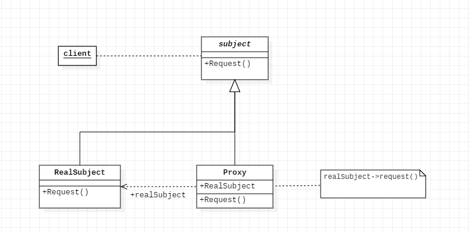

### 代理模式

#### 概述：
> 为其他对象提供一种代理以控制对这个对象的访问。在某些情况下，一个对象不适合或者不能直接引用另一个对象，而代理对象可以在客户端和目标对象之间起到中介的作用。
>

#### 组成：
1. **抽象角色**：通过```接口```或```抽象类```声明真实角色实现的业务方法。
2. **代理角色**：实现抽象角色，是真实角色的代理，通过真实角色的业务逻辑方法来实现抽象方法，并可以附加自己的操作。
3. **真实角色**：实现抽象角色，定义真实角色所要实现的业务逻辑，供代理角色调用。
#### 优点：
1. 职责清晰：真实的角色就是实现实际的业务逻辑，不用关心其他非本职责的事务，通过后期的代理完成一件完成事务，附带的结果就是编程简洁清晰。
2. 代理对象可以在客户端和目标对象之间起到中介的作用，这样起到了中介的作用和保护了目标对象的作用。
3. 高扩展性。

#### 类别
1. [静态代理](../src/proxy/ProxyTest.java)
2. 动态代理：[jdk动态代理](../src/proxy/JdkProxyTest.java)、 [cglib动态代理](../src/proxy/CglibProxyTest.java)等

#### JDK动态代理
jdk动态代理是通过接口创建的
 
 过程如下：
 
     1.获取 RealSubject上的所有接口列表；
     2.确定要生成的代理类的类名，运行时期生成文件默认为：com.sun.proxy.$ProxyXXXX ；
     3.根据需要实现的接口信息，在代码中动态创建 该Proxy类的字节码；
     4.将对应的字节码转换为对应的class 对象；
     5.创建InvocationHandler 实例handler，用来处理Proxy所有方法调用；
     6.Proxy 的class对象 以创建的handler对象为参数，实例化一个proxy对象
  
 通过设置系统参数```System.setProperty("sun.misc.ProxyGenerator.saveGeneratedFiles", "true")```可保存运行期间生成的代理类文件。
    
#### CJLIB动态代理
 Cglib 通过类继承机制生成动态代理类
  
  过程如下:
  
        1.查找A上的所有非final 的public类型的方法定义；
        2.将这些方法的定义转换成字节码；
        3.将组成的字节码转换成相应的代理的class对象；
        4.实现 MethodInterceptor接口，用来处理 对代理类上所有方法的请求（这个接口和JDK动态代理InvocationHandler的功能和角色是一样的）
 通过设置系统参数```System.setProperty(DebuggingClassWriter.DEBUG_LOCATION_PROPERTY, paths)```可保存运行期间生成的代理类文件。